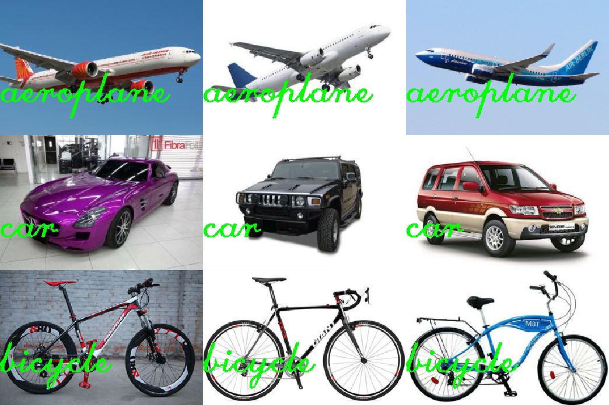

# bag-of-words

Python Implementation of Bag of Words for Image Recognition using OpenCV and
sklearn | [Video](https://www.youtube.com/watch?v=Ba_4wOpbJJM)

- Train 13 class ( mỗi class 10 ảnh)
```
python findFeatures.py -t dataset/train/
```

- Test nhiều ảnh -> ra tỉ lệ phần trăm
```
python getClass.py -t dataset/testnew --visualize
```

- Test 1 ảnh
```
python getClass.py -i dataset/test/aeroplane/test_1.jpg --visualize
```

